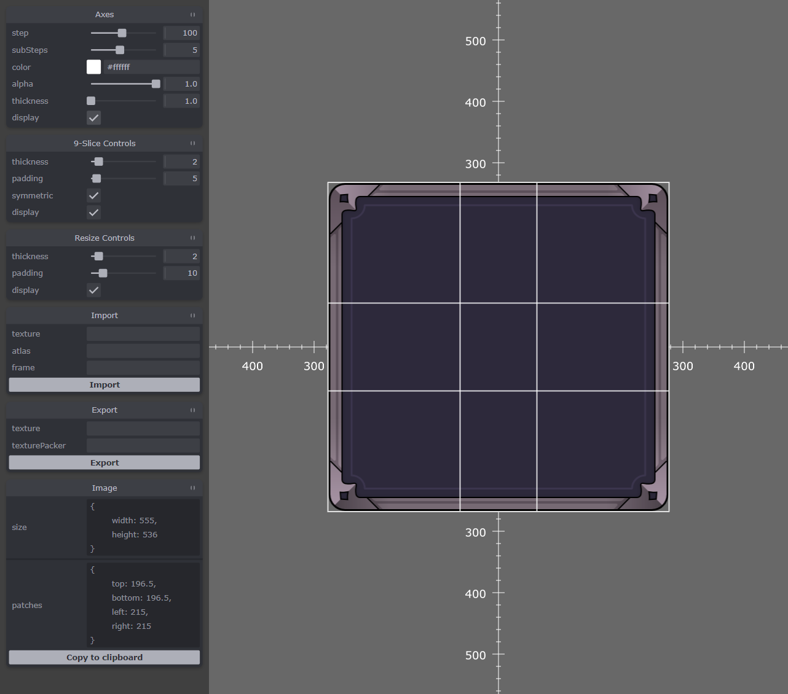

# Nice Slice Editor

## Summary
[What are the nine-slice or nine-patch images?](https://www.wikiwand.com/en/9-slice_scaling)

Nice Slice Editor is a handy tool designed to ease the usage of nice-slice images with [PhaserJS](https://github.com/photonstorm/phaser).

PhaserJS v3 doesn't support nice-slice images out of the box but there are few plugins that provide this functionality. This editor is based on [ninepatch-plugin from Koreez Games](https://github.com/koreezgames/phaser3-ninepatch-plugin).

## How to use
To start the editor run the following commands:
- `npm run ts-complile`
- `npm run serve-dev`

## Keyboard shortcuts
- **S** to display resize dialog
- **I or U** to import image or texture atlas
- **U or E** to export image
- **C** to copy nine-slice config to clipboard
- **A** to toggle axis (diplay / hide)
- **F** to toggle camera zoom (max / default)

## Development
To start developing run the following commands:
- `npm run ts-complile`
- `npm run ts-typecheck`
- `npm run serve-dev`

Application entry point is at **src/startup/Startup.ts**
